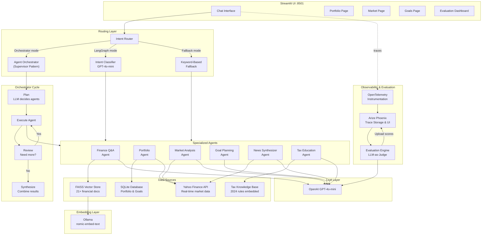
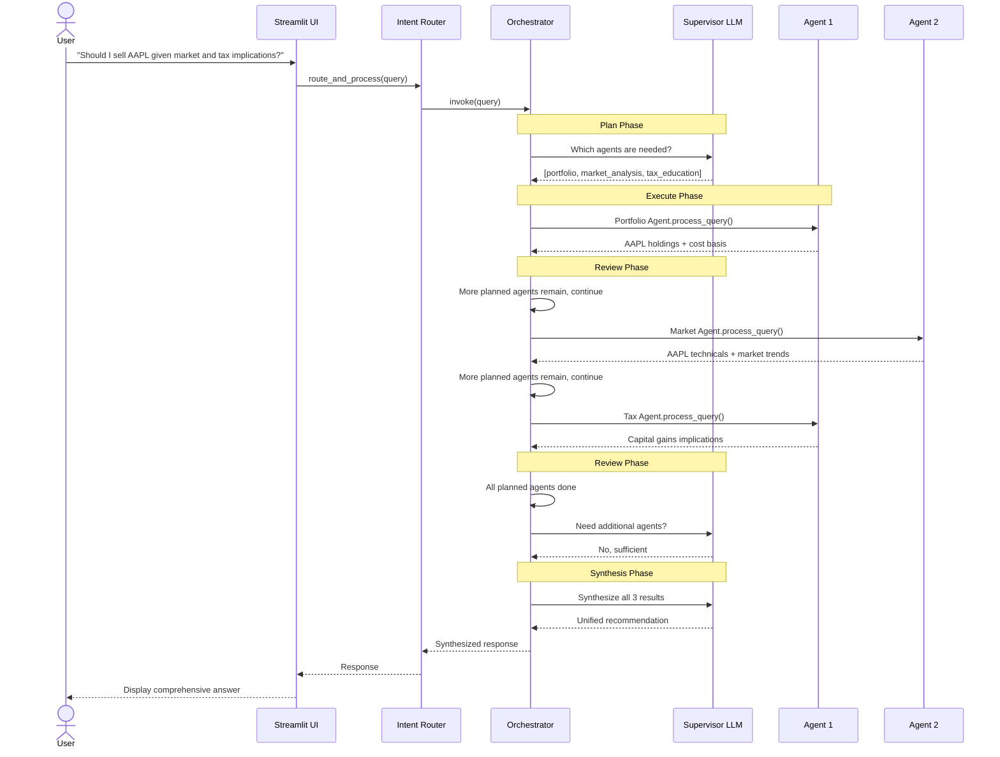
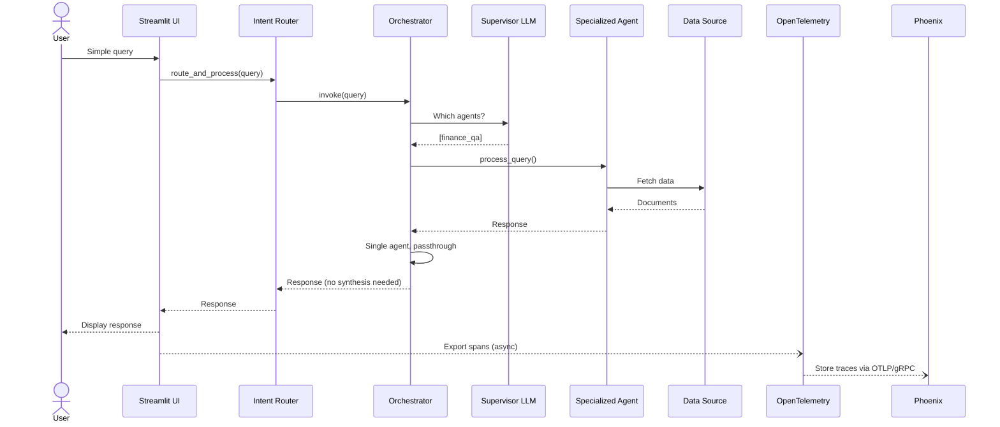
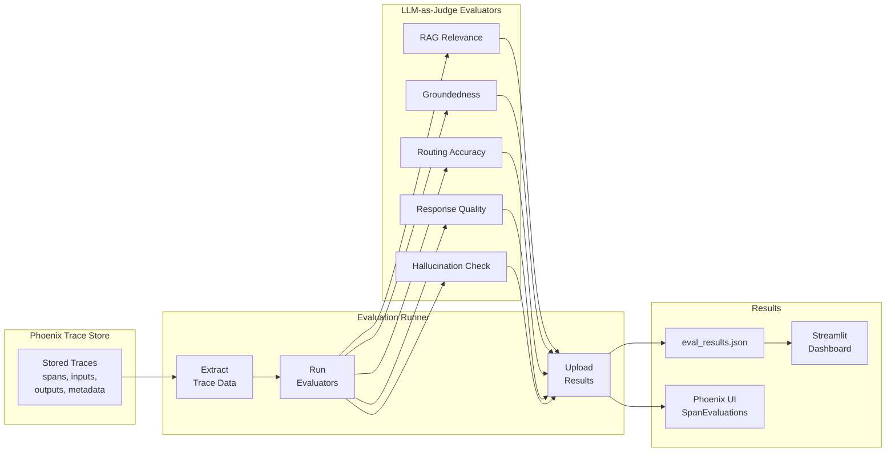
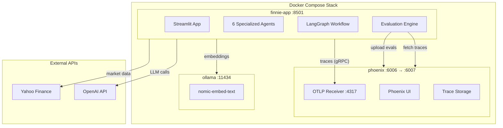

# FinnIE - Multi-Agent Personal Financial Advisor

FinnIE (Financial Intelligence Engine) is an AI-powered personal financial advisor that uses a multi-agent architecture to provide comprehensive financial guidance. Built with LangGraph for orchestration, RAG (Retrieval-Augmented Generation) for knowledge retrieval, and Phoenix for observability.

## Features

- **Multi-Agent Architecture**: Six specialized agents for different financial domains
- **LangGraph Orchestration**: Intelligent intent classification and routing
- **RAG-Powered Knowledge Base**: 21+ comprehensive financial education articles
- **Real-Time Market Data**: Integration with Yahoo Finance for live data
- **Portfolio Management**: Track holdings with database persistence
- **Observability**: Full tracing with Arize Phoenix and OpenTelemetry
- **Evaluation Engine**: LLM-as-judge evaluation with Phoenix trace analysis
- **Local Embeddings**: Cost-effective Ollama embeddings with nomic-embed-text

## Architecture

### System Overview



### Orchestrator Flow (Supervisor Pattern)



### Single-Agent Request Flow



### Evaluation Pipeline



### Docker Services



## Agents

| Agent | Purpose | Tools/Data Sources |
|-------|---------|-------------------|
| **Finance Q&A** | General financial education | RAG knowledge base (FAISS + Ollama) |
| **Portfolio** | Track holdings, get quotes | SQLite, yfinance |
| **Market Analysis** | Market overview, sectors, technicals | yfinance |
| **Goal Planning** | Retirement/savings calculations | LLM-powered planning |
| **News Synthesizer** | Market news and sentiment | yfinance news API |
| **Tax Education** | Tax strategies, account types | Embedded knowledge base (2024 rules) |

## Quick Start

### Prerequisites

- Python 3.10+
- Docker & Docker Compose
- OpenAI API key (for LLM)
- Ollama (optional, for local embeddings)

### Installation

1. **Clone the repository**
   ```bash
   git clone https://github.com/yourusername/ik-capstone-finnie.git
   cd ik-capstone-finnie
   ```

2. **Set up environment variables**
   ```bash
   cp .env.example .env
   # Edit .env with your API keys
   ```

3. **Run with Docker Compose** (Recommended)
   ```bash
   docker-compose up --build
   ```

4. **Or run locally**
   ```bash
   # Install dependencies
   pip install -e .

   # Start Ollama (for embeddings)
   ollama pull nomic-embed-text

   # Ingest knowledge base
   python app/rag/ingest.py

   # Run the app
   streamlit run app/main.py
   ```

### Access the Application

- **FinnIE UI**: http://localhost:8501
- **Phoenix Observability**: http://localhost:6007

## Configuration

### Environment Variables

| Variable | Description | Default |
|----------|-------------|---------|
| `OPENAI_API_KEY` | OpenAI API key for LLM | Required |
| `GOOGLE_API_KEY` | Google API key (optional) | Optional |
| `OLLAMA_BASE_URL` | Ollama server URL | `http://localhost:11434` |
| `EMBEDDING_MODEL` | Embedding model name | `nomic-embed-text` |
| `USE_LANGGRAPH` | Enable LangGraph routing | `true` |
| `USE_ORCHESTRATOR` | Enable multi-agent orchestrator | `false` |
| `PHOENIX_COLLECTOR_ENDPOINT` | Phoenix OTLP endpoint | `http://localhost:4317` |

### Routing Modes

FinnIE supports three routing modes with cascading fallback:

1. **Orchestrator Mode** (`USE_ORCHESTRATOR=true`): Multi-agent supervisor pattern — plans which agents to call, executes sequentially, reviews, and synthesizes a unified response. Best for accuracy.
2. **LangGraph Mode** (`USE_LANGGRAPH=true`, default): Single-agent LLM-based intent classification.
3. **Keyword Mode**: Fast heuristic routing based on keyword matching (always available as fallback).

Set `USE_ORCHESTRATOR=true` for multi-agent orchestration, or `USE_LANGGRAPH=false` for keyword-only routing.

## Usage Examples

### Financial Education
```
User: What is a Roth IRA?
Agent: [Finance Q&A] Retrieves information from knowledge base
```

### Portfolio Management
```
User: Add 10 shares of AAPL at $150
Agent: [Portfolio] Adds position to database

User: Show my portfolio
Agent: [Portfolio] Displays current holdings with live prices
```

### Market Analysis
```
User: How is the market today?
Agent: [Market] Shows S&P 500, Dow, NASDAQ performance

User: Give me a sector overview
Agent: [Market] Displays sector performance breakdown
```

### Goal Planning
```
User: I want to save $50,000 for a house in 5 years
Agent: [Goal] Calculates monthly savings needed with investment scenarios
```

### Tax Questions
```
User: What are the 401k contribution limits?
Agent: [Tax] Provides current limits and tax implications
```

### Market News
```
User: What's the latest market news?
Agent: [News] Aggregates and summarizes recent financial news
```

## Project Structure

```
ik-capstone-finnie/
├── app/
│   ├── agent/
│   │   ├── router.py         # Main routing logic
│   │   ├── finance_agent.py  # RAG-powered Q&A
│   │   ├── portfolio_agent.py # Portfolio management
│   │   ├── market_agent.py   # Market analysis
│   │   ├── goal_agent.py     # Goal planning
│   │   ├── news_agent.py     # News synthesis
│   │   └── tax_agent.py      # Tax education
│   ├── rag/
│   │   ├── ingest.py         # Document ingestion
│   │   └── retriever.py      # Vector store retrieval
│   ├── evaluation/
│   │   ├── evaluators.py     # LLM-as-judge evaluators
│   │   └── runner.py         # Phoenix trace evaluation runner
│   ├── workflow/
│   │   └── graph.py          # LangGraph workflow
│   ├── tools/
│   │   └── market_data.py    # Market data tools
│   ├── pages/
│   │   ├── 1_📊_Portfolio.py
│   │   ├── 2_📈_Market.py
│   │   ├── 3_🎯_Goals.py
│   │   └── 4_🔬_Evaluation.py
│   ├── main.py               # Streamlit application
│   ├── database.py           # SQLite portfolio storage
│   └── observability.py      # OpenTelemetry setup
├── data/
│   ├── knowledge_base/       # Financial education articles
│   └── vector_store/         # FAISS index
├── tests/
│   ├── unit/                 # Unit tests
│   ├── integration/          # Integration tests
│   └── conftest.py           # Pytest fixtures
├── docker-compose.yml
├── Dockerfile
├── pyproject.toml
└── README.md
```

## Knowledge Base

The knowledge base contains 21 comprehensive articles covering:

- **Investment Basics**: Stocks, bonds, ETFs, mutual funds
- **Portfolio Management**: Asset allocation, diversification, rebalancing
- **Retirement Planning**: 401(k), IRA, Social Security strategies
- **Tax Strategies**: Tax-efficient investing, tax-loss harvesting
- **Financial Planning**: Emergency funds, debt management, budgeting
- **Specialized Topics**: Real estate, behavioral finance, HSA/FSA, 529 plans
- **Reference**: 200+ term financial glossary

### Updating the Knowledge Base

1. Add markdown files to `data/knowledge_base/`
2. Run ingestion:
   ```bash
   python app/rag/ingest.py
   ```

## Evaluation

FinnIE includes an LLM-as-judge evaluation engine that analyzes agent performance using Phoenix traces.

### Evaluator Types

| Evaluator | What It Measures | Score Range |
|-----------|-----------------|-------------|
| **RAG Relevance** | Are retrieved documents relevant to the query? | 1-5 |
| **Groundedness** | Is the response grounded in retrieved sources? | 1-5 |
| **Routing Accuracy** | Was the correct agent selected? | 1-5 |
| **Response Quality** | Helpfulness, accuracy, coherence, completeness | 1-5 |
| **Hallucination** | Does the response contain fabricated facts? | 1-5 |

### Running Evaluations

```bash
# Inside Docker container
docker-compose exec finnie-app python -m app.evaluation.runner --limit 50 --phoenix-url http://phoenix:6006

# Or use make command
make evaluate
```

Results are uploaded to Phoenix as SpanEvaluations and saved to `eval_results.json` for the Streamlit dashboard.

## Testing

### Run All Tests
```bash
pytest
```

### Run with Coverage
```bash
pytest --cov=app --cov-report=html
```

### Run Specific Test Categories
```bash
# Unit tests only
pytest tests/unit/

# Integration tests only
pytest tests/integration/

# Specific agent tests
pytest tests/unit/test_agents.py -v
```

## Observability

FinnIE uses Arize Phoenix for observability:

- **Traces**: Full request/response tracing
- **Spans**: Agent execution, LLM calls, retrieval operations
- **Metrics**: Latency, token usage, error rates
- **Evaluations**: LLM-as-judge scores attached to traces

Access the Phoenix UI at http://localhost:6007 to view traces.

## Development

### Adding a New Agent

1. Create agent file in `app/agent/`:
   ```python
   class NewAgent:
       def __init__(self):
           self.llm = ChatOpenAI(model="gpt-4o-mini")

       def process_query(self, query: str) -> str:
           # Agent logic here
           return response
   ```

2. Register in `app/agent/router.py`:
   ```python
   from app.agent.new_agent import NewAgent
   new_agent = NewAgent()
   ```

3. Add routing logic in both LangGraph workflow and keyword router

4. Add tests in `tests/unit/test_agents.py`

### Code Style

- Follow PEP 8 guidelines
- Use type hints
- Add docstrings to public functions
- Run linting: `ruff check app/`

## API Reference

### Router

```python
from app.agent.router import route_and_process

response = route_and_process(
    user_input="What is a stock?",
    context=None  # Optional conversation context
)
```

### Individual Agents

```python
from app.agent.finance_agent import FinanceAgent
from app.agent.portfolio_agent import PortfolioAgent

finance = FinanceAgent()
response = finance.process_query("Explain compound interest")

portfolio = PortfolioAgent()
response = portfolio.process_query("Add 10 shares of MSFT at $400")
```

### RAG Retriever

```python
from app.rag.retriever import FinanceRetriever

retriever = FinanceRetriever()
docs = retriever.retrieve("What is an ETF?", k=3)
```

## Troubleshooting

### Common Issues

**Ollama connection failed**
```bash
# Ensure Ollama is running
ollama serve
# Pull the embedding model
ollama pull nomic-embed-text
```

**OpenAI API errors**
- Verify API key is set correctly
- Check API quota/billing
- Keyword routing works without OpenAI (fallback)

**Vector store not found**
```bash
# Re-run ingestion
python app/rag/ingest.py
```

**Port already in use**
```bash
# Change ports in docker-compose.yml or kill existing processes
lsof -i :8501  # Find process
kill -9 <PID>  # Kill it
```

## Contributing

1. Fork the repository
2. Create a feature branch (`git checkout -b feature/amazing-feature`)
3. Commit changes (`git commit -m 'Add amazing feature'`)
4. Push to branch (`git push origin feature/amazing-feature`)
5. Open a Pull Request

## License

This project is licensed under the MIT License - see the [LICENSE](LICENSE) file for details.

## Acknowledgments

- [LangChain](https://langchain.com/) - LLM framework
- [LangGraph](https://github.com/langchain-ai/langgraph) - Agent orchestration
- [Arize Phoenix](https://phoenix.arize.com/) - LLM observability
- [Streamlit](https://streamlit.io/) - UI framework
- [yfinance](https://github.com/ranaroussi/yfinance) - Market data
